# P02 History Knowledge Graph

Date: 2026-04-27

Purpose: keep the project aligned to a paper-level causal chain rather than a sequence of isolated smoke tasks. This document is written as a claim/evidence/action graph and should be treated as the current project memory.

## Graph Legend

- `C*`: paper-level claim candidate.
- `H*`: mechanism hypothesis.
- `E*`: executed evidence unit.
- `D*`: data/audit artifact.
- `M*`: model family/control.
- `R*`: risk/confound.
- `T*`: planned task or experiment.
- Edge labels: `supports`, `weakens`, `confounds`, `requires`, `routes_to`, `tests`.

## Paper-Level Claim Graph

```mermaid
flowchart TD
  C0["C0 downgraded: final-answer-correct self-distillation/pass@8 is the main contribution"]
  C1["C1 active: process-validity information is represented but verifier/selection can fail to read it"]
  C2["C2 active/weak: language-tokenizer-surface mechanisms causally raise process-unfaithful selection risk"]
  C3["C3 speculative method: process-consistency triangulation can reduce ACPI selection risk"]
  C4["C4 emerging: tokenizer/surface errors can be partly corrected by contextual middle-layer concept bridges, then re-entangled by late lexicalization/format priors"]

  H1["H1 surface-language/tokenizer perturbation: 七五折, 75% off, 打八折, ratio denominator, derivative notation"]
  H2["H2 middle contextual bridge: semantically equivalent concepts become closer in hidden states after early layers"]
  H3["H3 process-validity signal: first-error/support spans carry separable validity information"]
  H4["H4 late lexicalization/verdict prior: final tokens and requested language format dominate verifier output"]
  H5["H5 verifier reliability is language/objective conditioned"]
  H6["H6 natural ACPI exists but must be separated from truncation and after-final spill"]

  E01["E01 synthetic anchor matrix"]
  E03["E03 synthetic span residual patching"]
  E04["E04 manual-seed verifier reliability"]
  E05M["E05M manual audit of 139 hard-harvest rows"]
  E05H["E05 raw hard ACPI harvest: 448 rows"]

  D1["D1 62-row manual seed"]
  D3["D3 139-row E05 manual audit seed"]

  R1["R1 truncation/no-final can masquerade as reasoning failure"]
  R2["R2 after-final spill/prompt echo breaks training-candidate quality"]
  R3["R3 heuristic final-answer labels overcount correctness and miss process errors"]
  R4["R4 self-corrected scratch errors should not be merged with paper-grade unmarked ACPI"]
  R5["R5 verdict-position patching may be an output-prior artifact"]
  R6["R6 loader/tokenizer artifacts: hf5 only for Qwen3.5/Ministral"]

  T6["T6 E06 hardened verifier on E05 manual labels"]
  T7["T7 E07 semantic answer-option trap probe"]
  T8["T8 E08 contextual trap representation bridge"]
  T9["T9 E09 real-ACPI residual span patch"]
  T10["T10 QKV/MLP decomposition after real residual reproduction"]

  C0 -- weakens --> C1
  H3 -- supports --> C1
  H5 -- supports --> C1
  H1 -- tests --> C2
  H2 -- supports/tests --> C4
  H4 -- confounds/supports --> C1
  H6 -- requires --> C2
  C1 -- prerequisite --> C3
  C2 -- prerequisite --> C3
  C4 -- mechanism_bridge --> C2

  E01 -- supports --> H2
  E01 -- supports --> H4
  E03 -- supports --> H3
  E03 -- confounds --> R5
  D1 -- supports --> H6
  E04 -- supports --> H5
  E05H -- routes_to --> E05M
  E05M -- supports --> H6
  E05M -- supports --> R1
  E05M -- supports --> R2
  E05M -- supports --> R3
  E05M -- clarifies --> R4

  R1 -- requires --> T6
  R2 -- requires --> T6
  R3 -- requires --> D3
  R4 -- requires --> T9
  R5 -- requires --> T9
  H1 -- routes_to --> T7
  H2 -- routes_to --> T8
  H3 -- routes_to --> T9
  H4 -- routes_to --> T6
  T9 -- routes_to --> T10
```

## Current Stage Charter

Stage: `S2 causal-chain exploration / anchor-screening`.

Boundary: not method finalization, not paper integration, not artifact release. The goal is to cheaply determine which causal links are real enough to deserve expensive multi-model mechanism work.

Paper-level claim under test:

> Multilingual and surface-form perturbations can create answer-correct/process-invalid trace selection risk; this risk is not just a data-cleaning artifact because it corresponds to measurable verifier failure and patchable process/error-span representations.

Success for this stage requires at least one complete evidence chain:

1. natural trace has answer-correct/process-invalid or self-corrected process-error risk;
2. verifier accepts it more often than a conservative filter should;
3. answer-option or representation probe shows the same language/semantic trap is model-conditioned;
4. real-trace span patching moves the process-validity margin using first-error/support spans, not only verdict position.

Failure/downgrade conditions:

- ACPI remains rare after hard-harvest audit and most examples are merely truncation/format issues;
- verifier failures disappear after prompt hardening;
- real-trace span patching does not reproduce E03 beyond verdict-position effects;
- language-trap probes show no model/task conditioning beyond simple prompt wording artifacts.

## Claim Ledger

| Claim | Status | Upgrade Condition | Downgrade Condition | Current Evidence |
|---|---|---|---|---|
| C0 final-answer-correct self-distillation/pass@8 is the main contribution | downgraded | not planned | final-answer-only selection is shown sufficient | D1/D3 show final correctness diverges from process/format quality |
| C1 hidden states contain process-validity information that selection may miss | active, moderate | real ACPI span patch reproduces E03 in >=2 models | real ACPI patch effects vanish | E03 synthetic span patch; E04/E05M verifier/data-quality failures |
| C2 language/tokenizer mechanisms causally increase ACPI risk | active, weak-to-moderate | E07/E08/E09 jointly localize discount/derivative/ratio traps | language effects reduce to prompt or truncation artifacts | D3 finds language-semantic ACPI and final-wrong semantic drift |
| C3 process-consistency triangulation reduces ACPI selection | speculative | cross-route disagreement predicts manual invalidity and lowers false accept | all routes/verifiers fail without human labels | no direct test yet |
| C4 contextual bridge with late lexicalization re-entanglement | emerging | E08 shows layerwise trap margins and E09 links spans to verifier behavior | representation probes flat/noisy | E01 bridge supports generic concepts; specific trap bridge pending |

## Evidence Nodes

| Node | Artifact | Key Finding | Limit |
|---|---|---|---|
| E01 easy/hard anchor | `reports/E01_anchor_matrix_summary.md`, `reports/E01_anchor_matrix_hard_summary.md` | Qwen3-14B and Ministral strongest; DeepSeek/Phi fragile on hard invalid-final-correct anchors | synthetic cases only |
| E03 synthetic span patch | `reports/E03_span_patch_hard_summary.md` | trace/support-error spans causally move Yes-vs-No margins; verdict position often strongest | not real generated ACPI yet |
| D1 manual seed | `data/processed/manual_trace_audit_seed_20260427.jsonl` | 62 rows; 9 process-invalid; 2 clear ACPI; many truncation/spill confounds | easy tasks, small ACPI count |
| E04 verifier | `reports/E04_manual_trace_verifier_summary.md` | verifier false accept is objective/prompt-language conditioned; DeepSeek/Phi near always-yes on D1 | D1 small and easy |
| E05 raw harvest | `data/raw/e05_acpi_harvest_smoke/` | 448 rows over 14 hard tasks x 4 routes x 4 models x 2 samples | heuristic final-answer audit only |
| E05M manual audit | `data/processed/manual_e05_audit_seed_20260427.jsonl`, `reports/E05_manual_acpi_audit_summary.md` | 139 audited; 18 strict process-invalid; 9 strict ACPI; 4 paper-grade ACPI; 71 format-broken | selected/high-risk sample, not frequency estimate |

## E05M Manual Audit Findings

Manual audit policy is strict: if a trace asserts a mathematically or language-semantically false step, `manual_process_valid=false`; self-correction is recorded in `manual_risk`; `paper_grade_acpi=true` only for unmarked/high-risk examples.

| Slice | Count |
|---|---:|
| audited rows | 139 |
| process-valid / invalid / unknown | 118 / 18 / 3 |
| final-correct / wrong / unknown | 124 / 7 / 8 |
| format-clean / broken | 68 / 71 |
| strict ACPI | 9 |
| paper-grade ACPI | 4 |

Paper-grade ACPI anchors:

| idx | model | task | route | causal hook |
|---:|---|---|---|---|
| 178 | `phi4_mini_reasoning` | `deriv_sum` | zh->zh | wrong derivative rule: says `x` derivative is 0 while still pointing to 2x+3 |
| 234 | `qwen35_9b` | `disc_en_25_off` | zh->zh | discount-word mismatch: `打八折` equated to 75% but final 60 correct |
| 402 | `qwen3_14b_base` | `deriv_sum` | zh->zh | wrong rule justification: constant derivative zero used to justify `(3x)'=3` |
| 445 | `qwen3_14b_base` | `percent_then_discount` | zh->en | lexicalization mismatch: says `80% discount` but formula uses pay-80% |

Important non-ACPI semantic drift:

- `idx=358`, `qwen3_14b_base`, `disc_en_75_off`, en->zh: English `discounted by 75%` is translated as `打七五折/pay75%`, final 60 instead of 20.
- `idx=228/229`, `qwen35_9b`, `disc_zh_75_price`, zh->en: Chinese `七五折/pay75%` is treated as `75% off/pay25%`, final 20 instead of 60.
- `idx=444`, `qwen3_14b_base`, `percent_then_discount`, zh->en: Chinese `打八折/pay80%` is lexicalized as `80% discount`, final 60 instead of 80.

Format confound remains first-order: 71/139 audited rows are not clean training candidates due to truncation, placeholder answer, prompt echo, after-final continuation, or raw trim flags.

## Mainline Task And Evidence Chain

### Mainline A: Natural ACPI Existence

Question: do real generated answer-correct/process-invalid traces exist at usable frequency?

Current answer: yes for selected hard rows, but the audited pool is not a frequency estimate.

Required next evidence:

1. expand manual audit by active sampling from E05 raw if E09 needs more pairs;
2. separate `strict_acpi`, `paper_grade_acpi`, and `self_corrected_error` in all reports;
3. record earliest-error spans for real patching.

### Mainline B: Verifier Reliability Is Conditional

Question: do verifiers accept ACPI/format-broken traces, and is this conditioned by prompt language/objective?

Current answer: D1 says yes; D3 must be re-tested.

Next: `T6/E06` runs process-only and training-candidate verifier scoring on D3.

### Mainline C: Language-Semantic Trap Mechanism

Question: are discount/ratio/derivative failures merely surface prompt effects, or do they correspond to model-conditioned semantic preferences/representations?

Current answer: manual audit finds concrete trap anchors but no causal model-level mechanism yet.

Next:

1. `T7/E07`: answer-option logprob probe for correct vs trap answers under en/zh prompts;
2. `T8/E08`: contextual representation bridge for `七五折`, `75% off`, `打八折`, `20% off`, derivative-rule phrases.

### Mainline D: Real-Trace Mechanism Localization

Question: can hidden-state patching on real ACPI reproduce the synthetic E03 span effects?

Current answer: not yet tested.

Next: `T9/E09` patches real first-error/support/final/verdict spans on pairs such as 402 vs 403, 234 vs 235, 261 vs 260.

### Mainline E: Method Direction

Question: can process-consistency triangulation reduce trace-selection risk without heavy human supervision?

Current answer: not ready. It should wait until E06-E09 identify which disagreement signals matter.

## Model Nodes

| Model | Role | Current Reading |
|---|---|---|
| `qwen3_14b_base` | strongest base anchor | clean on many tasks but produced paper-grade derivative and 打八折 lexical ACPI; good E09 target |
| `qwen3_8b_base` | smaller Qwen anchor | useful mechanism control; not in E05 generation |
| `deepseek_r1_0528_qwen3_8b` | reasoning-distilled fragility/control | often correct but long/truncated; E04 near always-yes verifier on D1 |
| `qwen35_9b` | latest small Qwen candidate | rich format spill and semantic drift; produced paper-grade discount ACPI |
| `phi4_mini_reasoning` | non-Qwen reasoning-distilled control | derivative rule hallucinations; all audited high-risk rows format-broken |
| `ministral3_8b_reasoning` | non-Qwen stronger verifier anchor | strong synthetic behavior; generation omitted from E05 due loader/decode risk |
| `glm46v_flash` | weak/control | keep as negative/control, not primary mechanism evidence |

## Immediate Next Tasks

| Task | Branch | Purpose | Success Criterion |
|---|---|---|---|
| T6/E06 verifier on D3 | audit branch | test whether E04 verifier failure persists on harder E05 manual labels | false accept remains high on strict/paper-grade ACPI or training-candidate false accept |
| T7/E07 answer-option trap probe | primary branch | cheap semantic comprehension screen for discount/ratio/derivative traps | correct-vs-trap margins differ by model/language and align with manual drift |
| T8/E08 trap representation bridge | mechanism branch | test contextual bridge vs surface trap geometry | middle-layer correct-pair margin rises for at least one model/trap |
| T9/E09 real-ACPI span patch | causal branch | test C1/C2 on real generated traces | first-error/support span patch moves process margin beyond verdict-only confound |
| T10 QKV/MLP | contingency | only after E09 works | localize at head/MLP below residual stream |
