# P02 History Knowledge Graph R2

Date: 2026-04-27

Purpose: preserve the project as a causal-chain investigation, not as isolated smoke tasks. This R2 history integrates the original session discussion, E05 manual audit, E07/E08/E09 results, the round-2 human audit extension, and the next exploratory experiment package.

## Graph Legend

- `C*`: paper-level claim candidate.
- `H*`: mechanism hypothesis.
- `E*`: evidence unit already executed or running.
- `D*`: dataset/manual audit artifact.
- `R*`: confound or risk.
- `T*`: next task/experiment.
- Edge labels: `supports`, `weakens`, `confounds`, `requires`, `tests`, `upgrades_if`, `downgrades_if`.

## Claim Graph

```mermaid
flowchart TD
  C0["C0 downgraded: final-answer-correct self-distillation/pass@8 as main contribution"]
  C1["C1 active: process-validity / first-error information exists but absolute verifiers may not read it"]
  C2["C2 active: surface-language and lexicalization traps increase process-unfaithful selection risk"]
  C3["C3 speculative method: process-consistency triangulation can reduce selection risk"]
  C4["C4 revised: contextual middle-layer bridge may exist, but current cosine probe under-detects it"]
  C5["C5 emerging: output-language/format priors can re-entangle correct answers with wrong process text"]

  H1["H1 semantic trap family: 七五折/pay75, 75% off/pay25, 打八折/pay80, ratio denominator, derivative coefficient"]
  H2["H2 middle process signal: support/error spans contain separable residual information"]
  H3["H3 late verdict/lexicalization prior: final verifier token and output language dominate decisions"]
  H4["H4 verifier reliability is language/objective conditioned"]
  H5["H5 answer-prior probes are triage tools, not process labels"]
  H6["H6 format/truncation is a first-order data-cleaning confound"]

  D1["D1 62-row manual trace seed"]
  D3["D3 139-row E05 manual audit seed"]
  D4["D4 31-row round2 human audit extension; 154-row combined manual set"]

  E01["E01/E03 synthetic anchor + span patch"]
  E04["E04 manual-seed verifier reliability"]
  E05["E05 hard ACPI harvest + human audit"]
  E07["E07 answer-option semantic trap probe"]
  E08["E08 trap representation cosine bridge"]
  E09["E09 real ACPI residual span patch"]
  E10["E10 manual/E07 evidence-chain join"]
  E11["E11 running: dense non-verdict real span patch"]
  E12["E12 running: contrastive ACPI verifier"]

  R1["R1 final-answer correctness hides process-invalid traces"]
  R2["R2 truncation/spill/visible think tags make training-candidate filtering harder than process-only judging"]
  R3["R3 E07 option scoring has answer-form/token-length biases"]
  R4["R4 verdict-position patch can be output-prior rather than process understanding"]
  R5["R5 cross-route real pairs confound process error with output-language distribution"]
  R6["R6 E05 audited set is selected/high-risk, not a frequency estimate"]

  T13["T13 extend natural ACPI pair bank with same-route siblings"]
  T14["T14 MLP/attention-head decomposition only after non-verdict E11 survives"]
  T15["T15 process-consistency triangulation: route paraphrase + conservative reject policy"]
  T16["T16 generate harder multilingual trap pool across more model families"]

  C0 -- weakens --> C1
  D1 -- supports --> R1
  D3 -- supports --> R1
  D3 -- supports --> R2
  D4 -- supports --> R2
  E04 -- supports --> H4
  E01 -- supports --> H2
  E09 -- supports --> H2
  E09 -- supports --> H3
  E09 -- confounds --> R4
  E07 -- supports --> H1
  E07 -- confounds --> R3
  E08 -- weakens_or_revises --> C4
  E10 -- supports --> H5
  H1 -- supports --> C2
  H2 -- supports --> C1
  H3 -- supports --> C5
  H4 -- supports --> C1
  H5 -- requires --> T15
  H6 -- requires --> T15
  C1 -- prerequisite --> C3
  C2 -- prerequisite --> C3
  E11 -- tests --> R4
  E12 -- tests --> H4
  E11 -- upgrades_if --> T14
  E11 -- downgrades_if --> C1
  T13 -- requires --> D4
  T16 -- requires --> T15
```

## Stage Charter R2

Stage: `S2b causal-chain exploration / real-trace probe`.

Boundary: still not method finalization, not paper integration, and not artifact release. The purpose is to decide whether the observed chain is real enough to justify expensive QKV/MLP or training interventions.

Paper-level claim under test:

> Multilingual/surface-form traps can create answer-correct but process-invalid trace-selection risk. This risk is not merely bad data cleaning: real traces contain patchable support/error-span information, while absolute verifier prompts can miss or over-accept it under language/objective/format priors.

Upgrade condition for the next stage:

1. real ACPI examples are manually verified and not only truncation artifacts;
2. non-verdict process spans reproduce clean patch directions on at least two model/pair families;
3. contrastive verifiers can identify the invalid sibling better than absolute Yes/No prompts, or fail in an interpretable language-conditioned way;
4. the same task family yields route-level risk that can be reduced by a conservative triangulation policy.

Downgrade condition:

1. E11 dense non-verdict patching collapses to verdict-only effects;
2. contrastive verifiers cannot distinguish paired valid/bad traces despite direct comparison;
3. additional same-route audit finds no more paper-grade ACPI beyond the selected examples;
4. language effects are explained by format/truncation or answer-string scoring bias.

## Mainline Tasks And Evidence Chains

### Mainline A: Natural ACPI Existence

Current evidence:

- D3: 139 manually audited hard-harvest rows; 18 process-invalid, 9 strict ACPI, 4 paper-grade ACPI.
- D4: round-2 audit extension adds targeted controls and confirms many Qwen3.5 negatives are valid-but-format-broken rather than process-invalid; combined set has 154 rows, 9 strict ACPI, 4 paper-grade ACPI.
- Paper-grade anchors remain: `178` Phi derivative, `234` Qwen3.5 discount wording, `402` Qwen3-14B derivative rule, `445` Qwen3-14B 打八折 lexicalization.

Interpretation: natural ACPI exists in selected hard rows, but frequency is not estimated. The next useful audit is not random expansion; it is same-route sibling mining for cleaner causal pairs.

### Mainline B: Verifier Reliability Is Conditional

Current evidence:

- E04 on D1: absolute process-only prompts over-accept invalid traces; training-candidate prompts over-accept format-broken traces even more.
- E06 on D3 is running for Qwen3-14B, Qwen3.5, and DeepSeek; Phi has completed but summary waits for all files.
- E12 is launched to test whether pairwise contrast helps: if contrastive succeeds while absolute fails, the issue is threshold/Yes-bias rather than absent process signal.

Interpretation: the verifier question must be decomposed into absolute filtering vs pairwise discrimination vs conservative reject policy.

### Mainline C: Language-Semantic Trap Mechanism

Current evidence:

- E07 answer-option probe: Qwen3-14B is robust overall (`acc_avg=0.696`), while Qwen3.5 (`0.089`), DeepSeek (`0.125`), and Phi (`0.304`) show strong trap priors.
- E07 finds systematic wrong preferences: Qwen3.5 often prefers 80 for discount tasks, 24/15 for ratio tasks, 1 for remainder, 100 for sequential percent, and `3x^2+6x` for product derivative.
- E10 join shows E07 margin is a triage signal, not a label: strong negative margins contain many valid-but-format-broken rows, but key ACPI rows often lie in trap-sensitive task/routes.

Interpretation: answer priors identify fragile task/route/model slices but cannot replace manual process audit.

### Mainline D: Representation Bridge And Real-Trace Causality

Current evidence:

- E08 contextual cosine bridge is weak for discount surface forms: mean margins are near zero or negative; derivative valid-vs-constant-error is the only strong contrast across models.
- E09 real ACPI patching is positive but confounded: verdict-position is strongest for Qwen3.5 and Qwen3-14B.
- Non-verdict signal exists: Qwen3.5 `support_error_span` at early layers has clean effects for discount and ratio pairs; Qwen3-14B `trace_span` and `support_error_span` at L20 move in the clean direction for derivative pair.
- E11 dense non-verdict patching is running to decide whether this remains after excluding verdict position and adding a Qwen3-14B 打八折 pair.

Interpretation: the causal chain is plausible but not proven. Current strongest statement is "real trace process spans can move verifier margins in some pairs"; do not claim localized language neurons yet.

### Mainline E: Method Direction

Candidate method should not be generic routing. The stronger direction is process-consistency triangulation:

- generate or evaluate the same problem under route/paraphrase variants;
- reject traces when the process explanation changes semantics while the final answer remains stable;
- use contrastive sibling/verifier checks to identify first-error spans;
- only after E11/E12, test whether head/MLP features can support an automatic lightweight detector.

This method remains speculative until E12 and a same-route expanded ACPI bank are complete.

## Evidence Ledger

| Node | Artifact | Current Finding | Status |
|---|---|---|---|
| D3 | `data/processed/manual_e05_audit_seed_20260427.jsonl` | 139 manual rows; 9 strict ACPI; 4 paper-grade | active seed |
| D4 | `data/processed/manual_e05_audit_extension_round2_20260427.jsonl` | 31 targeted human labels; mainly valid controls and format risks | new |
| D4c | `data/processed/manual_e05_audit_combined_20260427.jsonl` | 154 combined rows; 77 format-broken | active combined seed |
| E07 | `reports/E07_semantic_trap_answer_probe_summary.md` | Qwen3-14B robust; Qwen3.5/DeepSeek/Phi fragile on answer priors | completed |
| E08 | `reports/E08_trap_representation_bridge_summary.md` | discount cosine bridge weak; derivative contrast strong | completed but revised |
| E09 | `reports/E09_real_acpi_span_patch_summary.md` | verdict dominates; non-verdict support/error spans positive in Qwen3.5 and Qwen3-14B | completed smoke |
| E10 | `reports/E10_evidence_chain_join_smoke.md` | E07 margin is triage not label; ACPI rows align only partially with answer-prior fragility | completed |
| E11 | `results/E11_real_acpi_span_patch_dense/` | dense non-verdict real patch launched on GPU2 | running |
| E12 | `results/E12_contrastive_acpi_verifier/` | contrastive ACPI verifier launched on GPU2 | running |
| E06 | `results/E06_e05_manual_trace_verifier/` | hardened absolute verifier on D3 | running/partial |

## Risk Ledger

| Risk | Why It Matters | Current Control |
|---|---|---|
| Frequency risk | E05 manual rows are selected/high-risk, not representative | report only existence; later stratified sampling |
| Format confound | 77/154 combined manual rows are format-broken | separate process-valid vs training-candidate labels |
| Answer-prior bias | E07 algebraic forms and token lengths bias margins | use E07 as triage only; rely on E09/E12 for mechanism |
| Verdict-position confound | E09 strongest effects are often final verifier token | E11 excludes verdict position |
| Cross-route confound | Qwen14 打八折 pair compares different output languages | use as exploratory only; mine same-route siblings before strong claim |
| Loader confound | Qwen3.5 requires hf5 path | record PYTHONPATH in logs and keep hf5 isolated |

## Current Stage Decision

Do not pivot to a broad "Chinese vs English capability gap" paper yet. The more publishable path is a sharper causal paper:

> When multilingual surface forms create semantically plausible traps, answer-correct traces can carry unfaithful process text. Real trace hidden states contain some support/error-span information, but absolute verifier prompts and late lexicalization priors can miss it. A conservative process-consistency triangulation method may reduce this risk.

This claim is still conditional on E11/E12. If E11 fails, downgrade to verifier/data-cleaning study. If E11 succeeds and E12 contrastive helps, upgrade to QKV/MLP localization and triangulation intervention.

## Immediate Next Tasks

| Task | Branch | Purpose | Stop/Continue Rule |
|---|---|---|---|
| Finish E06 | audit | quantify absolute verifier false accept on D3 | if false accept low, C1 weakens; if high, E12 becomes more important |
| Finish E11 | causal | test non-verdict real span patch without verdict confound | if positive in >=2 pairs, proceed to head/MLP; if not, stop localization |
| Finish E12 | verifier | test pairwise visibility of errors | if contrastive succeeds, design triangulation; if fails, collect stronger labels |
| T13 same-route pair mining | data | find cleaner ACPI/valid siblings for `445`, `234`, derivative cases | need at least 8 same-route pairs before statistics |
| T14 QKV/MLP decomposition | mechanism | localize only successful E11 spans | do not start until E11 passes |
