# P02 History Knowledge Graph R3

Date: 2026-04-27 CST
Project: `/home/Awei/P02_multilingual_process_lens`

本文件把本 session 的讨论和已落盘结果整理成“阶段章程 + 知识图谱 + 证据链条”。它不是任务 closeout，也不是论文定稿；用途是约束后续实验必须围绕可证伪的因果链推进。

## 0. Stage Charter

当前阶段：`S2c causal-chain scouting / human-audited exploratory probes`。

阶段边界：

- 不是旧的 pass@8 / self-distillation 选题，也不是单纯“中文 vs 英文能力差距”大叙事。
- 不是方法最终化；当前只允许提出候选方法机制，不能宣称 process-consistency triangulation 已被证明。
- 不是 QKV/MLP 大规模定位阶段；只有当真实 sibling pair 的 non-verdict span patch 与 contrastive verifier 同时站住脚，才进入 head/MLP 分解。
- 本阶段核心产物是：人工审计锚点、同题 sibling pair bank、verifier 误判链条、可执行的下一轮探路实验。

Paper-level claim candidate under test:

> 多语言/表层语义陷阱会产生 answer-correct but process-invalid 的 trace-selection 风险；这些风险并不只是“答案错/格式坏”，而可能由 surface lexicalization、过程语义、verifier objective/threshold 之间的错配共同造成。真实 trace 中存在可被 sibling comparison 或 residual span patch 暴露的 process/error-span 信号，但 absolute Yes/No verifier 往往会过度接受。

升级条件：

1. 人工审计确认的 unmarked ACPI 不只来自截断或格式错误，且至少覆盖折扣/比例/导数中的两个机制家族。
2. same-route 或 near same-route sibling pair 上，contrastive verifier 明显优于 absolute verifier。
3. non-verdict span patch 在同题 sibling 上复现，且不是只 patch final/verdict token。
4. conservative triangulation 在 oracle simulation 中能显著降低 paper-grade ACPI 保留率，同时保留足够 clean rows；随后需要自动化 proxy。

降级条件：

1. 扩展 pair bank 后，contrastive verifier 的优势消失，只剩位置/顺序偏差。
2. non-verdict patch 只在 cross-route 或 final-answer-confounded pair 上有效。
3. 新人工审计发现 paper-grade ACPI 极少且不可复现。
4. 所谓语言机制完全可由格式/truncation/answer-option scoring artifact 解释。

## 1. Knowledge Graph Legend

- `C*`: paper-level claim candidate.
- `H*`: mechanism hypothesis.
- `D*`: data/manual audit artifact.
- `E*`: executed evidence unit.
- `T*`: next task or running probe.
- `R*`: risk/confound.
- Edge labels: `supports`, `weakens`, `confounds`, `requires`, `tests`, `upgrades_if`, `downgrades_if`.

## 2. Claim/Mechanism Graph

```mermaid
flowchart TD
  C0["C0 downgraded: outcome-only pass@8/self-distillation main claim"]
  C1["C1 active: process-invalid information exists in real traces but absolute verifier often misses it"]
  C2["C2 active: multilingual/surface lexical traps create process-unfaithful selection risk"]
  C3["C3 candidate method: process-consistency triangulation may reduce selection risk"]
  C4["C4 revised: tokenizer/contextual bridge is not yet established by cosine probes"]
  C5["C5 active: late lexicalization/format/verdict priors re-entangle correct answer with bad process"]
  C6["C6 emerging: sibling comparison can reveal errors hidden from absolute Yes/No judging"]

  H1["H1 trap families: 七五折/pay75 vs 75% off/pay25; 打八折/pay80 vs 80% discount; ratio denominator; derivative coefficient/constant"]
  H2["H2 real support/error spans carry process-validity signal"]
  H3["H3 absolute verifier has Yes/accept prior and language/objective conditioning"]
  H4["H4 answer-option trap priors are useful triage, not process labels"]
  H5["H5 same-route sibling disagreement is a stronger causal unit than isolated traces"]
  H6["H6 format/truncation is a training-candidate confound, not equivalent to process invalidity"]

  D1["D1 manual_trace_audit_seed: early 62-row seed"]
  D3["D3 E05 manual audit seed: 139 rows"]
  D4["D4 combined manual audit: 154 rows, 18 invalid, 9 strict ACPI, 4 paper-grade ACPI"]
  D5["D5 E13 same-route/near-route pair bank: 41 pair records"]

  E04["E04 early manual verifier: absolute verifier over-accepts invalid/format-broken traces"]
  E05["E05 hard ACPI harvest + human audit"]
  E06["E06 hardened absolute verifier on E05: high false-accept across 4 verifiers"]
  E07["E07 semantic-trap answer-option probe: Qwen14 robust, Qwen3.5/DeepSeek/Phi fragile"]
  E08["E08 representation bridge cosine: discount weak, derivative contrast stronger"]
  E09["E09 real ACPI span patch: positive but verdict-confounded"]
  E10["E10 manual/E07 join: answer margins are triage not labels"]
  E11["E11 dense non-verdict span patch: non-verdict effects survive in 4 pairs"]
  E12["E12 contrastive ACPI verifier: Qwen14/Qwen3.5 improve over absolute judging"]
  E13["E13 same-route pair mining: same-route candidates identified"]
  E14["E14 oracle triangulation policy smoke: same-route reject removes ACPI on selected set with moderate coverage loss"]
  E15["E15 verifier-chain join: absolute false-accept coexists with contrastive visibility"]
  T16["T16 expanded contrastive pair probe on 11 pairs / 4 verifier models"]
  T17["T17 semantic-drift/non-verdict span patch on same-route qwen14 and qwen35 pairs"]

  R1["R1 selected/high-risk audit set, not prevalence estimate"]
  R2["R2 format/truncation and visible think tags confound training-candidate validity"]
  R3["R3 E07 answer option scoring has tokenization/option-length bias"]
  R4["R4 verdict-position patch can be output-prior not process understanding"]
  R5["R5 cross-route sibling pair can mix process error with output-language distribution"]
  R6["R6 contrastive order bias: bad_A/bad_B must be balanced"]

  C0 -- weakens --> C1
  D3 -- supports --> C1
  D4 -- supports --> C1
  D4 -- supports --> C2
  D5 -- tests --> H5
  E06 -- supports --> H3
  E07 -- supports --> H1
  E07 -- confounds --> R3
  E08 -- weakens --> C4
  E09 -- supports --> H2
  E09 -- confounds --> R4
  E10 -- supports --> H4
  E11 -- supports --> H2
  E11 -- requires --> R5
  E12 -- supports --> C6
  E12 -- confounds --> R6
  E13 -- supports --> H5
  E14 -- tests --> C3
  E15 -- supports --> C6
  H1 -- supports --> C2
  H2 -- supports --> C1
  H3 -- supports --> C5
  H4 -- requires --> H5
  H5 -- prerequisite --> C3
  H6 -- requires --> C3
  T16 -- tests --> C6
  T17 -- tests --> H2
```

## 3. 主线任务与证据链条

### Mainline A: Natural ACPI / Process Error Existence

问题：真实生成轨迹里是否存在“答案正确但过程错误”的高风险样本？

证据：

- `D4`: `data/processed/manual_e05_audit_combined_20260427.jsonl` 含 154 条人工审计；process-invalid 18 条，strict ACPI 9 条，paper-grade ACPI 4 条。
- 关键 paper-grade anchors:
  - `234`: Qwen3.5，`disc_en_25_off`，`zh->zh`，把“优惠25%”说成“打八折，即原价75%”，答案 60 正确。
  - `402`: Qwen3-14B，`deriv_sum`，`zh->zh`，把“3 是常数，常数导数为0”作为 `(3x)'=3` 的理由，答案 2x+3 正确。
  - `445`: Qwen3-14B，`percent_then_discount`，`zh->en`，说 “apply an 80% discount” 但公式乘 0.80，答案表达式等价正确。
  - `178`: Phi derivative，过程里出现 `x 的导数是0` 但最终文本多处指向正确答案；格式截断，作为机制锚点而非干净训练样本。

当前判断：ACPI 存在性成立，但频率未知；不能用该 selected set 宣称自然分布频率。

### Mainline B: Verifier Reliability / Trace Selection Risk

问题：如果用 verifier 清洗数据，是否能筛掉这些 ACPI？

证据：

- `E06`: hardened absolute verifier 在 `process_only` 模式下仍高 false accept：
  - DeepSeek process-invalid false accept: 0.944-1.000；ACPI false accept: 1.000。
  - Phi process-invalid false accept: 1.000；ACPI false accept: 1.000。
  - Qwen3.5 process-invalid false accept: 0.944-1.000；ACPI false accept: 0.889-1.000。
  - Qwen3-14B 最好但仍高：process-invalid false accept 0.722-0.833；ACPI false accept 0.778-0.889。
- `E12`: contrastive verifier 对 4 对 sibling 的整体正确率：Qwen3.5 0.875、Qwen3-14B 0.812、Phi 0.688、DeepSeek 0.438。
- `E15`: absolute false accept 与 contrastive visibility 同时出现；整体 absolute bad false-accept 0.938，但 contrastive acc 0.703。

当前判断：verifier 失败不是“完全看不到过程信息”，而是 absolute objective/threshold/prompt 与 late priors 的错配；contrastive/sibling comparison 是更有希望的切口。

### Mainline C: Language-Semantic Trap Mechanism

问题：语言/表层形式是否确实参与了 process error，而不是随机数学错误？

证据：

- `E07`: answer-option probe 显示 Qwen3.5/DeepSeek/Phi 对折扣、比例、导数有强 trap priors；Qwen3-14B 更稳但仍出现 ACPI。
- `E10`: E07 margin 不是 process label；强负 margin 里有大量 valid-but-format-broken rows。它只能用于选择高风险 task/route/model slice。
- 人工锚点显示 language-semantic drift：`229` 把七五折解释成 75% off；`358` 把 75% off 中文化为打七五折；`445` 把打八折英文 lexicalize 成 80% discount。

当前判断：不能写成“中文能力差”；更准确的 claim 是 multilingual surface-form traps 触发特定语义映射错误。

### Mainline D: Representation / Causal Localization

问题：错误是否能在 hidden residual span 中被因果干预，而不是仅由 final/verdict token 决定？

证据：

- `E08`: discount contextual cosine bridge 弱；不可宣称 tokenizer/contextual concept bridge 已被证明。导数 valid-vs-constant-error contrast 较强。
- `E09`: verdict-position patch 效果强，存在 output-prior confound。
- `E11`: 排除 verdict_pos 后，non-verdict span patch 仍有正向信号：
  - Qwen3.5 discount `support_error_span` L3: v2b=0.750, b2v=-3.812。
  - Qwen3.5 ratio `support_error_span` L3: v2b=1.000, b2v=-1.562。
  - Qwen3-14B 打八折 `support_error_span` L9: v2b=0.125, b2v=-2.750，但 cross-route，谨慎。
  - Qwen3-14B derivative `trace_span` L20: v2b=0.500, b2v=-0.375。

当前判断：hidden process signal 有初步因果证据，但还不足以定位到 Q/K/V/MLP 神经元。下一步应优先 same-route pair patch，再 head/MLP decomposition。

### Mainline E: Candidate Method / Process-Consistency Triangulation

问题：是否能用 route/paraphrase/sibling comparison 减少 answer-correct/process-unfaithful 选择风险？

证据：

- `E13`: 从 154 条人工审计中挖出 41 个 pair records；same-route 7 个、same-reason 21 个、same-task 13 个。
- `E14`: oracle policy smoke 显示：
  - `final_correct_only` 会接受 138/154 条，其中保留 9 个 ACPI、4 个 paper-grade ACPI。
  - `format_and_final` 仍保留 3 个 ACPI、3 个 paper-grade ACPI。
  - `same_route_reject_if_any_invalid` 在 selected set 上 accepted=69，coverage=0.448，clean recall=0.958，invalid/ACPI kept=0。

当前判断：triangulation 是有潜力的 method branch，但目前只是 oracle simulation；必须用自动化 signals 逼近人工同题一致性判断。

## 4. Evidence Ledger

| Node | Artifact | Finding | Status |
|---|---|---|---|
| D4 | `data/processed/manual_e05_audit_combined_20260427.jsonl` | 154 rows; 18 invalid; 9 strict ACPI; 4 paper-grade ACPI | active |
| E06 | `reports/E06_e05_manual_trace_verifier_summary.md` | absolute verifier over-accepts process-invalid and ACPI across all 4 verifiers | completed |
| E07 | `reports/E07_semantic_trap_answer_probe_summary.md` | answer priors flag trap-sensitive task/routes; not labels | completed |
| E08 | `reports/E08_trap_representation_bridge_summary.md` | discount cosine bridge weak; derivative contrast stronger | completed/revised |
| E11 | `reports/E11_real_acpi_span_patch_dense_summary.md` | non-verdict span effects survive in 4 pairs | completed smoke |
| E12 | `reports/E12_contrastive_acpi_verifier_summary.md` | contrastive verification helps Qwen family | completed smoke |
| E13 | `reports/E13_same_route_pair_mining_summary.md` | 41 sibling pair records, 7 same-route | completed |
| E14 | `reports/E14_process_triangulation_policy_summary.md` | conservative same-route rejection looks promising as oracle policy | completed smoke |
| E15 | `reports/E15_verifier_chain_disagreement_summary.md` | absolute false-accept coexists with contrastive visibility | completed |
| E16 | `reports/E16_contrastive_pair_expansion_summary.md` | 11-pair expanded contrastive probe; Qwen14 0.818, Qwen3.5 0.750, DeepSeek near chance | completed |
| E17 | `reports/E17_real_semantic_drift_span_patch_summary.md` | Qwen14 358/359 strong non-verdict patch; Qwen3.5 234/235 reproduced | completed |

## 5. Risk Ledger

| Risk | Why it matters | Control |
|---|---|---|
| Selected-set bias | E05 manual rows are high-risk, not prevalence | report existence and pair quality, not population frequency |
| Format confound | 77/154 rows are format-broken | separate process validity from training-candidate validity |
| Self-correction ambiguity | self-corrected traces are unsafe for training but weaker paper-grade ACPI | tag `paper_grade_acpi` separately |
| E07 scoring bias | option forms/tokenization can flip margins | use E07 only for triage |
| Verdict/output prior | span patch may just alter final Yes/No token | E11/E17 exclude verdict_pos or report separately |
| Cross-route confound | route changes can alter style/language distribution | prioritize E13 same-route pairs |
| Contrastive order bias | model can prefer A/B position | E12/T16 balance `bad_A` and `bad_B` |

## 6. Next Experimental Branches

Primary branch: `same-route sibling verification`

- Expanded contrastive verifier on 11 pairs (`E16`) completed; compare against E12 and use for method bounds.
- Success condition: Qwen family remains >0.75 on unmarked/same-route pairs; DeepSeek failure remains interpretable rather than random.
- Failure condition: performance collapses on new same-route rows or order bias dominates.

Audit branch: `human sentence-level labels`

- Expand manual sentence_labels for same-route pairs 358/359, 234/235, 261/260, 402/403, 445/442, plus negative controls 296/297 and 208/209.
- Separate labels: semantic lexical error, arithmetic slip, self-correction, final wrong, format/truncation.

Causal branch: `non-verdict span patch on same-route semantic drift`

- E17 completed on qwen14 `358/359`/`402/403` and qwen35 `234/235`/`229/225`; next is module decomposition only for robust spans.
- Success condition: support/error spans move verifier margins in clean directions without verdict span.
- Failure condition: only final_answer_span or cross-route style spans move margins.

Contingency branch: `method downgrade`

- If T16/E17 weaken, stop QKV/MLP localization and pivot to verifier/data-cleaning paper: absolute verifier false accept, contrastive mitigation, and human-audited ACPI taxonomy.

## 7. Post-Launch Result Update

After writing the initial R3 charter, T16 and T17 completed successfully.

### T16 / E16 Expanded Contrastive Pair Probe

Artifact: `reports/E16_contrastive_pair_expansion_summary.md`.

Overall result across 11 pairs / 44 balanced prompt-order rows per verifier:

| verifier | acc | mean margin | reading |
|---|---:|---:|---|
| Qwen3-14B base | 0.818 | 1.195 | strongest generalization; perfect on Qwen3.5 bad traces, weaker on its own derivative/discount semantic drift |
| Qwen3.5 9B | 0.750 | 0.681 | solid but weaker on Qwen14 lexical/semantic drift; strong on own discount/ratio/product rows |
| Phi-4-mini-reasoning | 0.568 | -0.181 | unstable; order/pair sensitivity high |
| DeepSeek-R1-Qwen3-8B | 0.477 | 0.095 | near chance; negative result remains important |

Interpretation: E12 contrastive finding partially generalizes. It is not universal across model families. Qwen family can often see process invalidity in pairwise form, but semantic-drift pairs like Qwen14 `358/359` and `445/442` remain difficult. This upgrades C6 for Qwen-family verifiers but keeps H3 language/objective conditioning active.

### T17 / E17 Same-Route Semantic-Drift Span Patch

Artifact: `reports/E17_real_semantic_drift_span_patch_summary.md`.

Key result:

- Qwen14 same-route `disc75 en->zh 358/359`: non-verdict clean effects are strong. Best `problem_span` L14 v2b=2.250, b2v=-1.000; `support_error_span` L20 v2b=0.750, b2v=-0.625; `trace_span` L20 v2b=1.625, b2v=-1.000.
- Qwen14 `deriv_sum 402/403` reproduces earlier clean L20 trace/support signal but remains smaller.
- Qwen3.5 `discount 234/235` reproduces earlier support_error_span L3 clean effect.
- Qwen3.5 `qiwuzhe 229/225` is not clean in v2b direction; b2v drops strongly but valid->bad does not improve bad-trace acceptance. Treat as asymmetric/cross-input confounded.

Interpretation: E17 materially strengthens H2 for one same-route semantic-drift pair and reproduces Qwen3.5 discount. It does not yet justify neuron-level claims; next step should decompose the robust spans only: Qwen14 `358/359` problem/support spans at L9/L14/L20 and Qwen3.5 `234/235` support_error_span at L3/L8.

Updated status: `T16` and `T17` move from planned/running to completed exploratory probes. C6 remains active; C3 remains speculative but more plausible.
